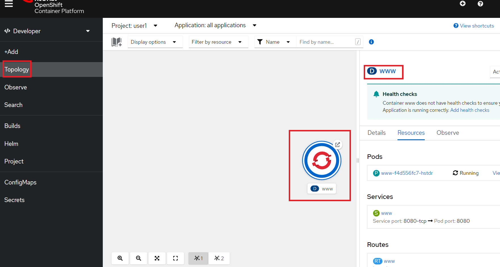
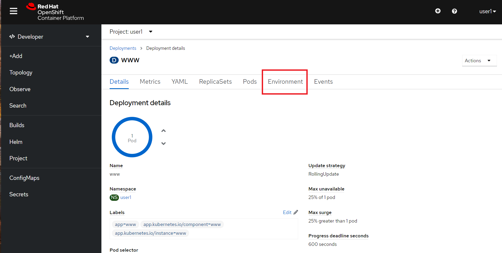
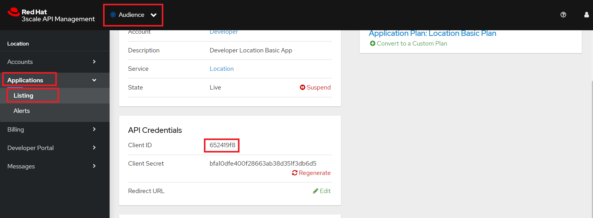
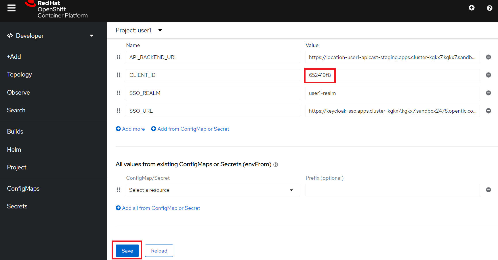
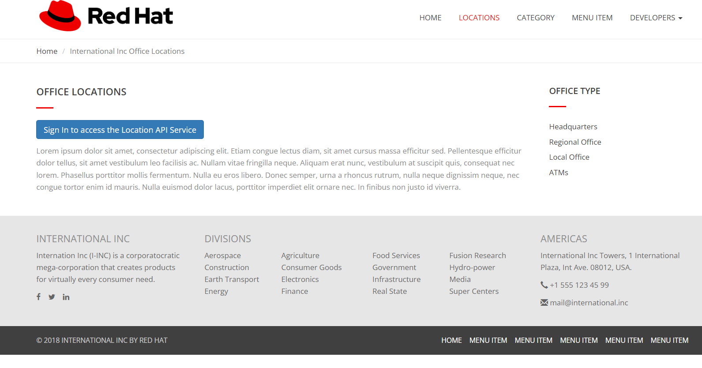
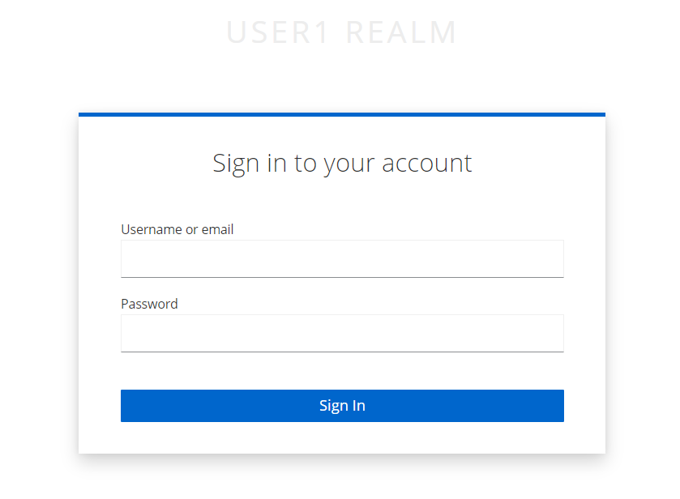
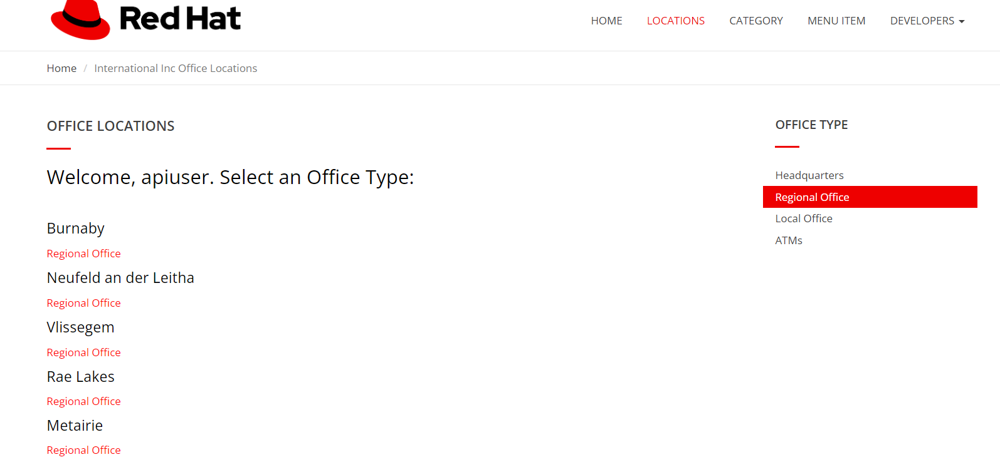

:walkthrough: Testing the International Inc. Locations page using our newly authenticated locations API
:next-lab-url: https://tutorial-web-app-webapp.{openshift-app-host}/tutorial/dayinthelife-integration.git-citizen-integrator-track-lab07/
:3scale-url: https://www.3scale.net/
:3scale-admin-url: https://{user-username}-admin.{openshift-app-host}/p/login
:3scale-dev-portal-url: https://{user-username}.{openshift-app-host}/
:sso-url: https://keycloak-sso.{openshift-app-host}/auth/admin/{user-username}-realm/console
:openshift-url: {openshift-host}
:user-password: openshift

ifdef::env-github[]
:next-lab-url: ../lab06/walkthrough.adoc
endif::[]

[id='testing-web-app']
= Lab 5 - Testing the Web Application

In this lab you will test the security enhancements for the International Inc. Locations web application.

Audience: API Consumers, Developers, Architects

*Overview*

This lab demonstrates the International Inc. Locations page using our newly authenticated locations API.

*Why Red Hat?*

Applications can be built from many technologies. In this case we use a simple web application, but a wide range of Red Hat and non-Red Hat technologies could be used.

*Credentials:*

Your username is: `{user-username}` +
Your password is: `{user-password}`

[type=walkthroughResource]
.OpenShift Console
****
* link:{openshift-url}[Console, window="_blank"]
****

[type=walkthroughResource]
.Red Hat SSO Console
****
* link:{sso-url}[Console, window="_blank"]
****

[type=walkthroughResource]
.3scale Console
****
* link:{3scale-admin-url}[Console, window="_blank"]
****

[time=5]
[id="update-openshift"]
== Update Application Deployment

You can change an Application behavior by simply passing new parameters to it. Let's change the application deployment configuration.

. On the Resource section, click on the *OpenShift Console* link.
. Authenticate using your user and password.
. Navigate to your project's overview page. It will be called `{user-username}`.
. Click on *Topology* view.
. Click on the pod icon to open the deployment information.
. On the top, click on the deployment name, *www*
+

. With the deployment configuration page open, click on *environment*
+

. In the deployment configuration page, find the *CLIENT_ID* value. It should be `CHANGE_ME`.
+
image::images/03-deploy-env.png[03-deploy-env, role="integr8ly-img-responsive"]

. We need to retrieve the CLIENT_ID created for our Application. In another browse tab, go back to 3scale Admin Console and look for the `dev_location_app`(Audience > Applications > Listing).
+

. After copying the *client_id*, go back to the deployment configuration tab. Update the *CLIENT_ID* value and then click on the *save* button. This will trigger a new application deployment, now running with the right configuration.
+

[type=verification]
Did you deploy it successfully?

[type=verificationFail]
Try to redo this section, if any problem persists have your instructor check the build.

[time=5]
[id="update-sso"]
== Update SSO On Application Callback

Redirect URLs are a critical part of the OAuth flow. After a user successfully authorizes an application, the authorization server will redirect the user back to the application with either an authorization code or access token in the URL. Because the redirect URL will contain sensitive information, it is critical that the service doesn't redirect the user to arbitrary locations.

. Navigate to link:{sso-url}[SSO Admin, window="_blank"]

. Log into Red Hat Single Sign On using your credentials. Click on *Sign In*.
+
image::images/00-login-sso.png[00-login-sso.png, role="integr8ly-img-responsive"]

. Select *Clients* from the left menu.
+
image::images/00-clients.png[00-clients.png, role="integr8ly-img-responsive"]
+
_3scale, through it's https://github.com/3scale/zync/[zync] component, already synchronized the application information into the Red Hat SSO security realm_.

. Click on the *CLIENT_ID* link to view the details.
+
_Remember to select CLIENT_ID with the one you got in the **Integrator Lab 4 API Security Lab**. It will easily identifiable as its and hexadecimal name_.
+
_If you do not find the CLIENT_ID, make sure you correctly executed the sync between 3scale and RHSSO in Lab 4, Task 3.11.  You should also check Step 1.4 in this lab to ensure that the **SSO_URL** correctly begins with `https://`_
+
image::images/consume-24.png[24-client-application, role="integr8ly-img-responsive"]

. Scroll down, type in and select the following options in the application configuration:
+
|===
| Field | Value

| Access Type
| Public

| Standard Flow Enabled
| ON

| Implicit Flow Enabled
| OFF

| Valid Redirect URIs
| https://www-{user-username}.{openshift-app-host}/*

| Web Origins
| *
|===
+
image::images/consume-25.png[25-client-config, role="integr8ly-img-responsive"]

. Finally, click *Save* button to persist the changes.

[type=verification]
Were you able to make and save the changes?

[type=verificationFail]
Try to redo this section, if any problem persists have your instructor check the Kubernetes pod that contains the RH SSO application.

[time=5]
[id="test-webpage"]
== Opening International Inc Web Page

International Inc web development team created a Node.js application for the company home page. They added a page to locate their offices around the world.
In this step you will deploy that application.

. Open a new browser window in incognito mode. _(Since you already logged in SSO, you already have a valid token for you current browser. We want you log again, but now using the user we created in the previous lab.)_

. Navigate to `https://www-{user-username}.{openshift-app-host}`.

. You should now see what the development team created for International Inc. Click *LOCATIONS* to check the locations page.
+
image::images/10-application-page.png[10-application-page, role="integr8ly-img-responsive"]

. You can notice now the *Sign In* button in the page.
+

[type=verification]
Does the *Sign In* button appear?

[type=verificationFail]
Try to redo this section, if any problem persists have your instructor check the Kubernetes pod that contains the web application.

[time=5]
[id="test-SSO-integration"]
== Test the Single Sign On Integration

. Let's test the integration. Click the *Sign In* button.

. You are being redirected to Red Hat Single Sign On *Login Page*. Login using the user credentials you created in the link:../lab05/#add-user-to-realm[API Security Lab]
 ** Username: *apiuser*
 ** Password: *apipassword*
+

. You will be redirected again to the *LOCATIONS* page where now you will be able to select the International Inc Offices types.
+

[type=verification]
Are you able to search for locations?

[type=verificationFail]
Try to redo this section, if any problem persists have your instructor check the Kubernetes pod that contains the web application.

_Congratulations!_ You have successfully tested the International Inc. Locations webpage using a full SSO authenticated API.

[time=1]
[id="summary"]
== Summary

In total you should now have been able to follow all the steps from designing and API, deploying it's code, issuing keys, connecting OpenID connect and calling it from an application. This gives you a brief overview of the creation and deployment of an API. There are many variations and extensions of these general principles to explore!

[time=1]
[id="steps-beyond"]
== Steps Beyond
So, you want more? If you have time, you can try our bonus lab. This lab focuses demonstrates Fuse Online, showcasing Apicurito to define your API contract, autogenerate an integration, deploy it, then secure your newly created API using 3scale Smart Discovery.

If you'd like to try this out, you can now proceed to `Lab 6`.

[time=1]
[id="further-reading"]
== Notes and Further Reading

* http://microcks.github.io/[Red Hat 3scale API Management]
* https://developers.redhat.com/blog/2017/11/21/setup-3scale-openid-connect-oidc-integration-rh-sso/[Setup OIDC with 3scale]
