:walkthrough: Deploying APIcast Using the Operator
:3scale-admin-url: https://{user-username}-admin.{openshift-app-host}/p/login
:3scale-portal-url: {user-username}-admin.{openshift-app-host}
:3scale-gateway: stg-{user-username}.{openshift-app-host}
:openshift-url: {openshift-host}
:user-password: openshift

ifdef::env-github[]
endif::[]

[id='testing-web-app']
= Lab 7 - Deploying APIcast Using the Operator

Learn how to deploy a self-managed instance of APIcast.

Audience:  Developers, Architects and Operations team

*Overview*

3scale has a distributed architecture that separates the server and the component responsible for handling applications request, the gateway.
Thanks to this design approach, we can deploy the gateway near to the applications and backends, reducing request latency  and  providing scalability, which will increase the overall API performance

There are different ways to deploy the gateway, but today you will learn how to deploy the gateway on OpenShift using the APIcast Operator.

*Credentials:*

Your username is: `{user-username}` +
Your password is: `{user-password}`

[type=walkthroughResource]
.OpenShift Console
****
* link:{openshift-url}[Console, window="_blank"]
****

[type=walkthroughResource]
.3scale Admin Console
****
* link:{3scale-admin-url}[Console, window="_blank"]
****

[time=3]
[id="provider-key"]
== Getting the Provider Key

Before deploying the gateway we need to create a `Secret` with the 3scale server access information.

* Go to link:{3scale-admin-url}[3scale Admin Console, window="_blank"]
* On the top dropdown menu, select `Account Settings`

{empty} +

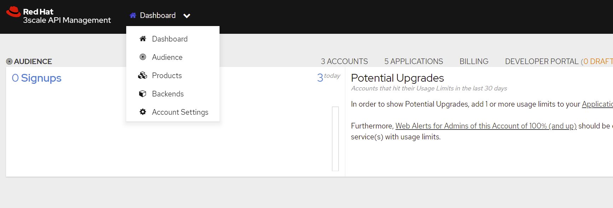

{empty} +

* In the overview page you will see a `Provider Key`, a token that we'll use to allow the gateway to get information from the 3scale server.

{empty} +

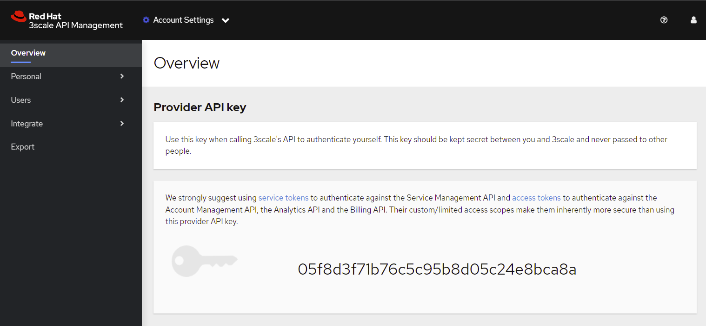

{empty} +

* Take note of the key value. We will need it for the next section.

[type=verification]
Did you get the Provider Key?

[time=3]
[id="secret"]
== Creating the Credentials Secret

Now that you have the `Provider Key`, let's create a secret with the portal access information.

* Go to link:{openshift-url}[OpenShift Console, window="_blank"].
* On the Developer view, click on `Secret`.

{empty} +

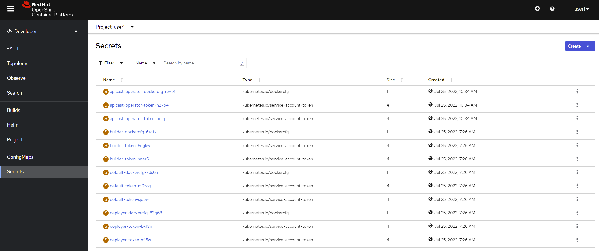
{empty} +

* Click on `create` and then select `key/value secret`

{empty} +

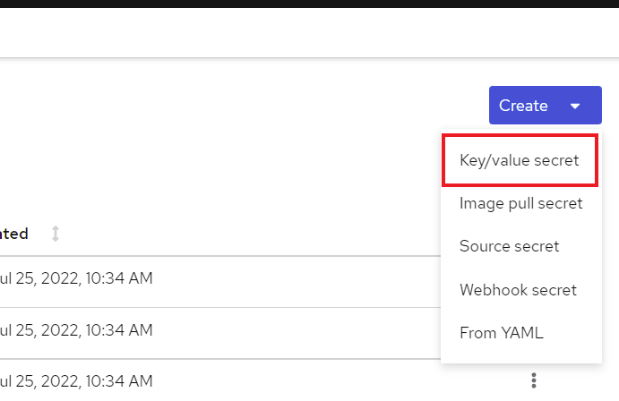

{empty} +

* Add the following values:
** `secret-name`: *gateway-secret*
** `key`: *AdminPortalURL*
** `value`: it's *https://* + *provider-key* + *@* + *{3scale-portal-url}*

{empty} +

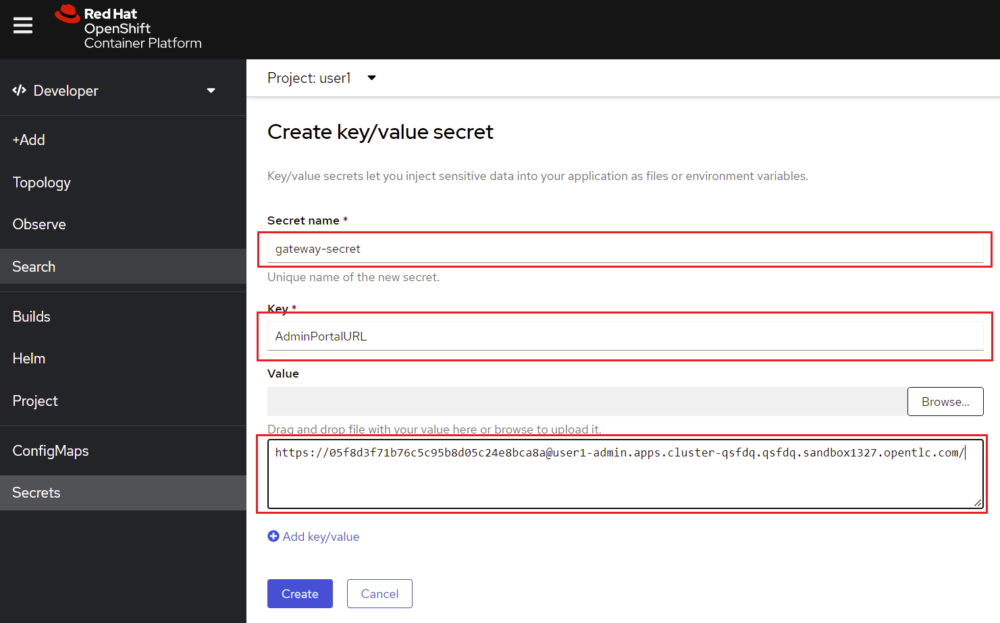
{empty} +

* After adding the values, click on `create`.

[type=verification]
Did you create the secret?

[time=3]
[id="exposing-echo"]
== Exposing ECHO API

Echo API is a 3scale cloud hosted API that comes pre-configured with 3scale to demonstrate how to perform basic configuration.
We are going to use it as our test API.

* Go to link:{3scale-admin-url}[3scale Admin Console, window="_blank"]
* On the top dropdrown menu, select `Products`
* In the products list, select `API`

{empty} +

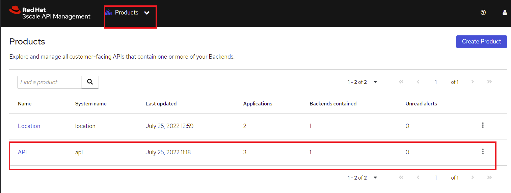

{empty} +

* In the overview page, under `Configuration, Methods and Settings` you'll find the service `name` and `id`.

{empty} +

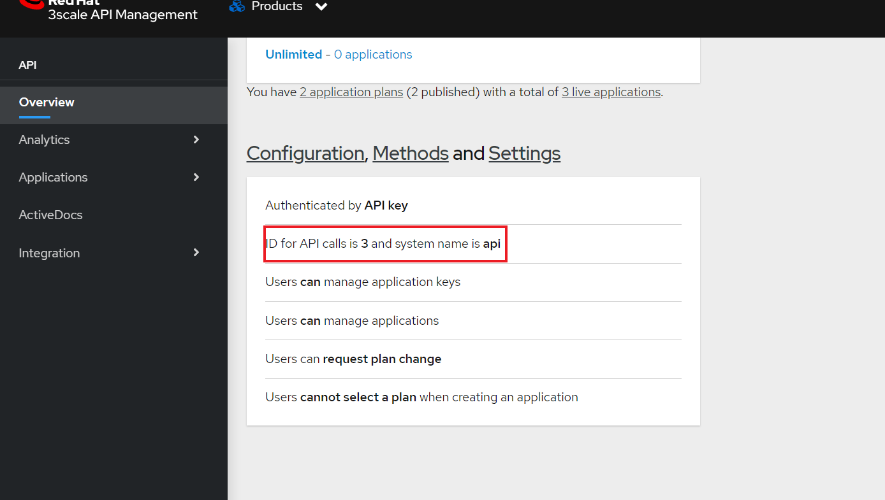

{empty} +

[type=verification]
Did you find the ID?

[time=3]
[id="cr"]
== Deploying the APIcast CR

Operators use Custom Resources Definitions(CRD) to create manifest files that describe a particular service or deployment definition,
Custom Resources(CR). Let's create an APIcast definition to deploy the 3scale gateway in your own user namespace.

* Go to link:{openshift-url}[OpenShift Console, window="_blank"].
* On the Developer view, click on `Add`.
* Select `Operator Backed`.

{empty} +

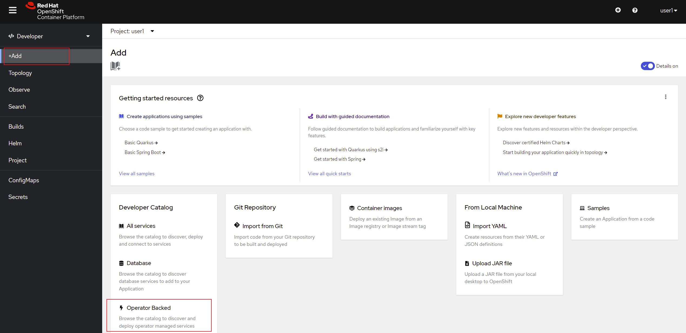

{empty} +

* You may use the search filter to find the `APIcast Operator`

{empty} +

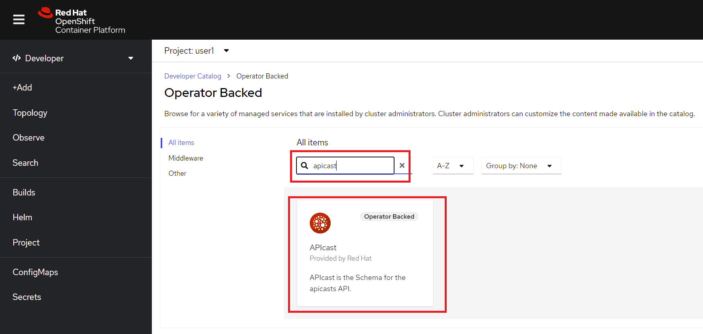

{empty} +

* After selecting APIcast, click on `create`
* In the CR page, select "YAML view"

{empty} +

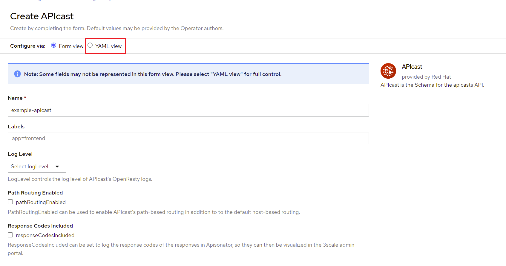

{empty} +

* Paste the following definition in the YAML input field. Remember to replace `enabledServices` with the ID you saw in the previous section:

{empty} +

[source,yaml,subs="attributes+", id="apicast-cr"]
----
kind: APIcast
apiVersion: apps.3scale.net/v1alpha1
metadata:
  name: stg-apicast
  namespace: {user-username}
spec:
  adminPortalCredentialsRef:
    name: gateway-secret
  configurationLoadMode: lazy
  deploymentEnvironment: staging
  enabledServices:
    - '3'
  exposedHost:
    host: {3scale-gateway}
    tls:
    - {}
  logLevel: debug
  replicas: 1
----

{empty} +

* Click on `Create`
* After the deployment is done you should be able to visualize the gateway pod and it's route

{empty} +

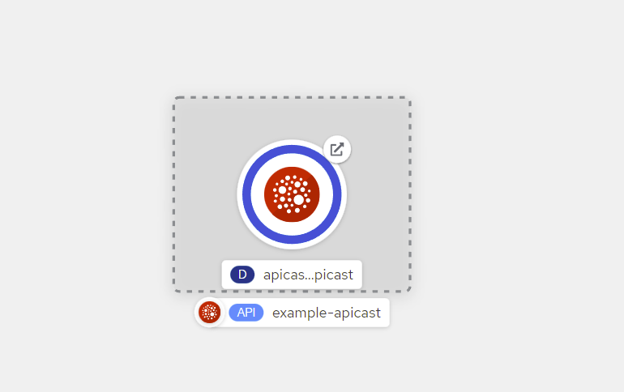

[type=verification]
Did you deploy the gateway successfully?

[time=5]
[id="config-test"]
== Configuring the API and Testing

Before testing our gateway deployment we need to configure our API to exposed by the self-managed gateway.

* Go to link:{3scale-admin-url}[3scale Admin Console, window="_blank"]
* On the top dropdrown menu, select `Products`
* In the products list, select `API`
* In the `Integration` category, click on `Settings`
* Under `Deployments`, select `APIcast self-managed`
* Enter *https://{3scale-gateway}* as the `Staging Public Base URL`

{empty} +

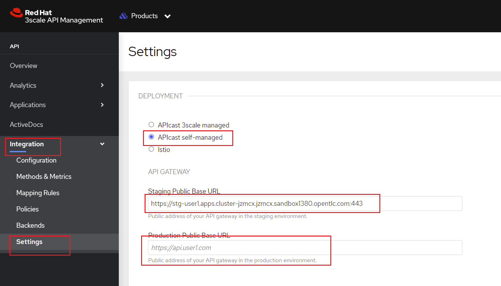

{empty} +

* Scroll down to the end of the page and click on `Update Product`

{empty} +

Now that you have your gateway configured you must promote your configuration.

* Go to `Integration > Configuration` and click on `Promote v.1 to Staging`:

{empty} +

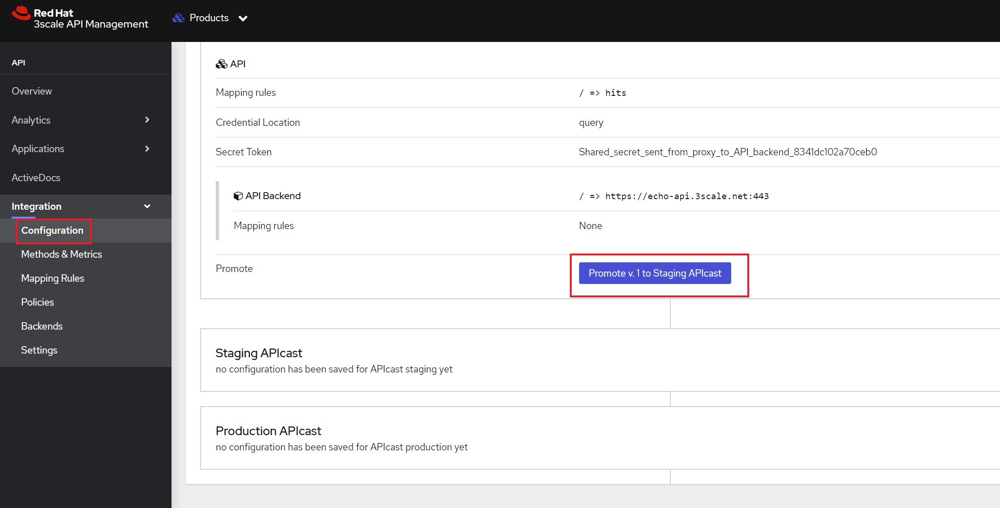

{empty} +

* Once you click it that will generate a test call using one application `user_key`. Copy only the address in the cURL command:

{empty} +

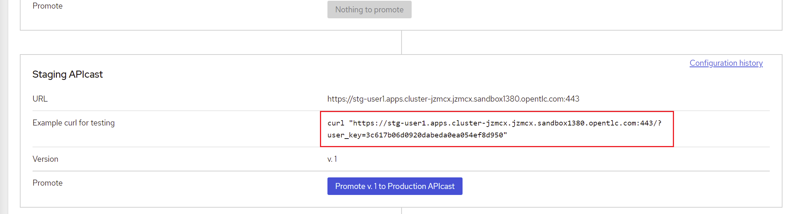

{empty} +

* Instead of using cURL, paste that URL on your browser. You should get a response like this:

{empty} +

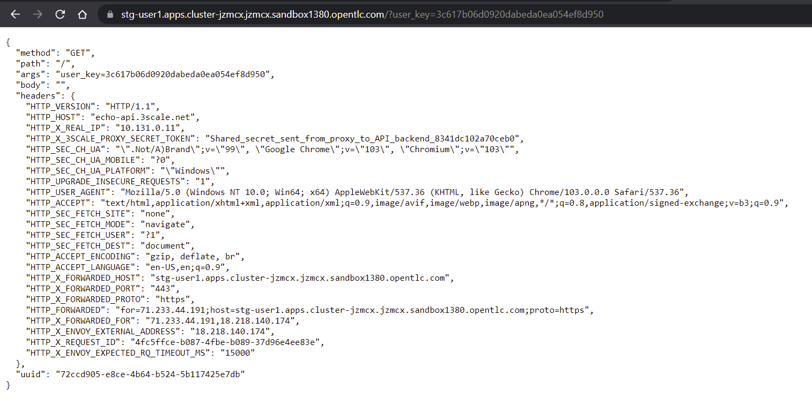

{empty} +

[type=verification]
Did you get a response like in the example?

[time=1]
[id="summary"]
== Summary

You finished Lab 7. In this lab you learned:

. How to provide access to an external 3scale gateway
. How to deploy a gateway on OpenShift using the APIcast Operator
