:walkthrough: Deploying APIcast Using the Operator
:3scale-admin-url: https://{user-username}-admin.{openshift-app-host}/p/login
:3scale-portal-url: {user-username}-admin.{openshift-app-host}
:3scale-gateway: stg-{user-username}.{openshift-app-host}
:openshift-url: {openshift-host}
:user-password: openshift

ifdef::env-github[]
endif::[]

[id='testing-web-app']
= Lab 8 - Using 3scale Service Discovery

Create API Products and Backends based on services deployed on OpenShift.

Audience:  Developers, Architects and Operations team

*Overview*

We can facilitate the way we create API Products on 3scale. Instead of manually adding them using the Admin console or using the Custom Resources, we can annotate the application Kubernetes Services,
so 3scale can find those backends and map them as Products.

Let's see how this can be done.

*Credentials:*

Your username is: `{user-username}` +
Your password is: `{user-password}`

[type=walkthroughResource]
.OpenShift Console
****
* link:{openshift-url}[Console, window="_blank"]
****

[type=walkthroughResource]
.3scale Admin Console
****
* link:{3scale-admin-url}[Console, window="_blank"]
****

[time=6]
[id="example-service"]
== Deploying an example service

We need a REST service deployed on OpenShift before using 3scale to scan the cluster and find that service. Since 3scale is going to use the user permissions to scan the cluster,
we need to deploy the service in a namespace you can access, so let's use `{user-username}`.

* Go to link:{openshift-url}[OpenShift Console, window="_blank"]
* In the `Developer` view, on the left side menu, click on `+Add`

{empty} +

image::images/add.png[Add Menu, role="integr8ly-img-responsive"]

{empty} +

* In the `Git Repository` category, click on `Import from Git`.

{empty} +

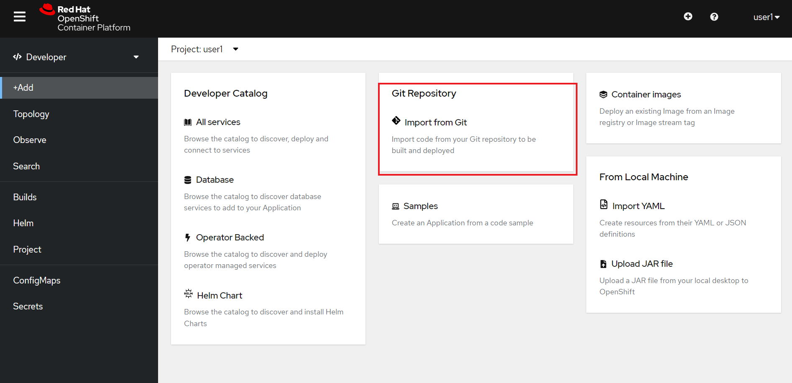

{empty} +

* In the next step, add `https://gitlab.com/3scale-app-demos/fruits-api` as the git repo. This is a *Quarkus* application that exposes a simple REST API with an OpenAPI schema.

{empty} +

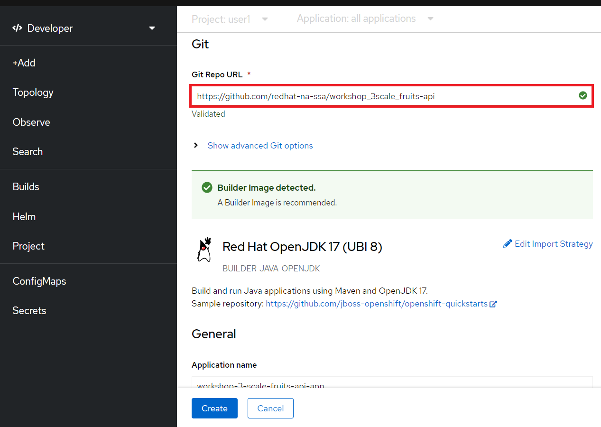

{empty} +

* Click on `Create`. In the topology view you will see that a new application was added and that the image build is running.

{empty} +

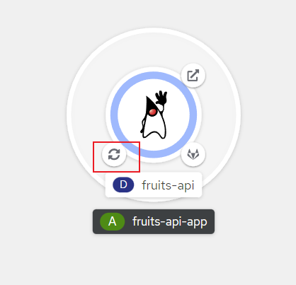

{empty} +

* Once the build is done you will see a green icon. After that expect that the Java icon will be dark blue.

{empty} +

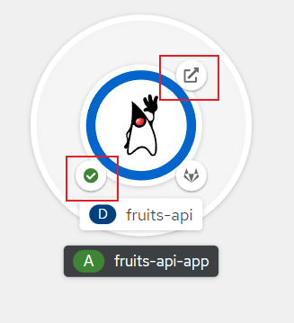

{empty} +

* Click on the arrow icon on the top. You should be able to visualize Quarkus home page.

{empty} +

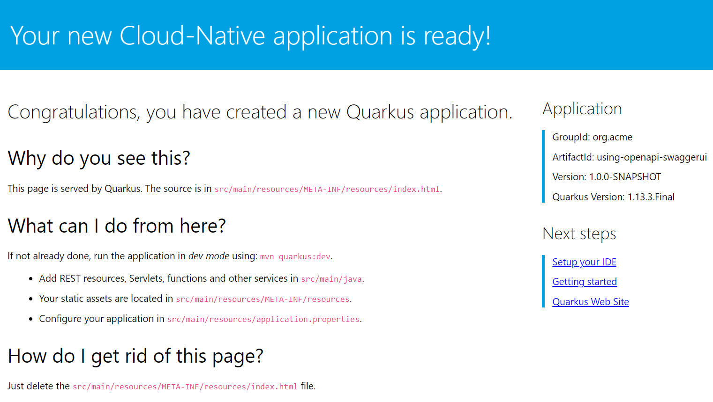

{empty} +

[type=verification]
Did you deploy the application successfully?

=== Annotating the Application

In order to identify which application should be imported by 3scale and how to do it, we need to annotate the service definition of our application.

* In the Administrator view on the link:{openshift-url}[OpenShift Console, window="_blank"], select `Networking > Services`. Click on `fruits-api`.

{empty} +

image::images/services.png[Services, role="integr8ly-img-responsive"]

{empty} +

* We need to add the following annotations and label to the object:

{empty} +

----
metadata:
  annotations:
    discovery.3scale.net/scheme: "http"
    discovery.3scale.net/port: '8080'
    discovery.3scale.net/path: "/fruits"
    discovery.3scale.net/description-path: "/q/openapi?format=json"
 labels:
    discovery.3scale.net: "true"
----

{empty} +

* The final object should look like the following. Do not forget to click on `Save` after you are done with your modifications.

{empty} +

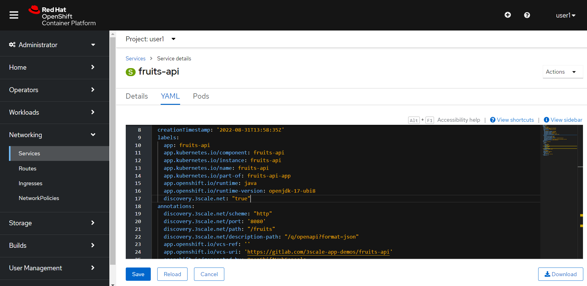

{empty} +

[type=verification]
Did you update the service?

[time=6]
[id="discovering-apis"]
== Discovering APIs with 3scale

* Start by accessing link:{3scale-admin-url}[3scale Admin Console, window="_blank"]
* In the `Dashboard` view, click on `Create Product`.

{empty} +

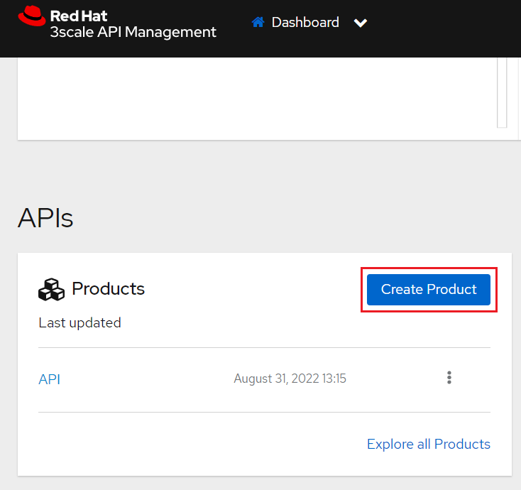

{empty} +

* You can see that we have two options to create a new product: To define it manually or Import from OpenShift.
* We are going to use the second option. Notice that in order to enable the second option we need to authenticate first.

{empty} +

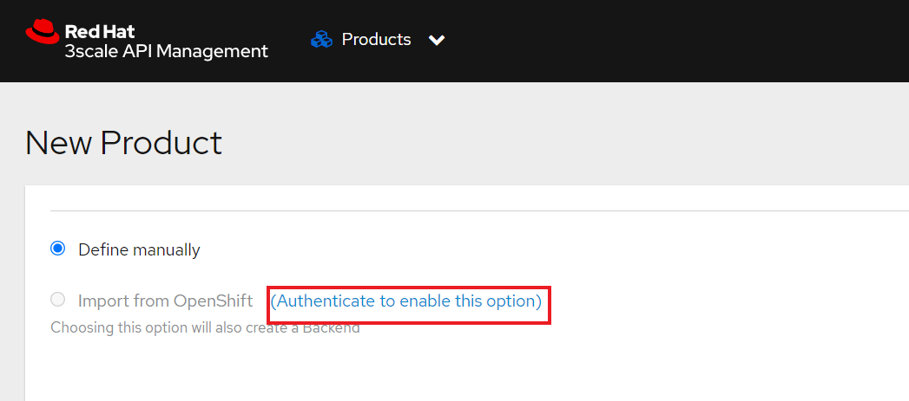

{empty} +

* authenticate using your OpenShift user and password then give 3scale permission by clicking on `allow selected permission`.

{empty} +

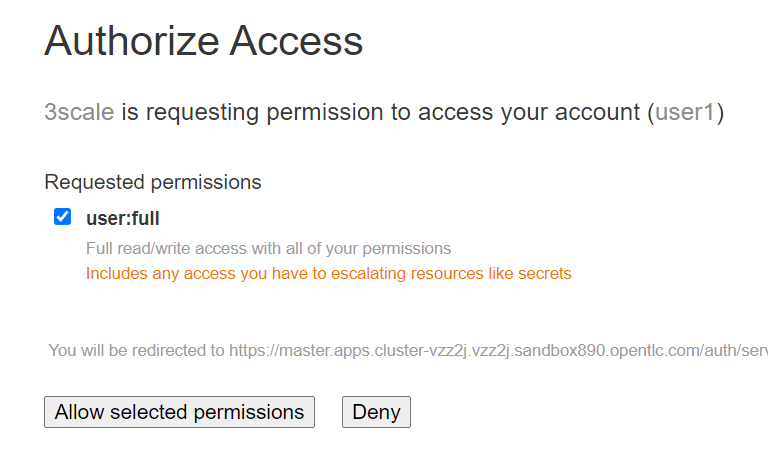

{empty} +

* now you are able to select the second option. Once you do it, you will see that your namespace and the `fruits-api` service are listed in the Product session. Click `Create Product` to proceed.

{empty} +

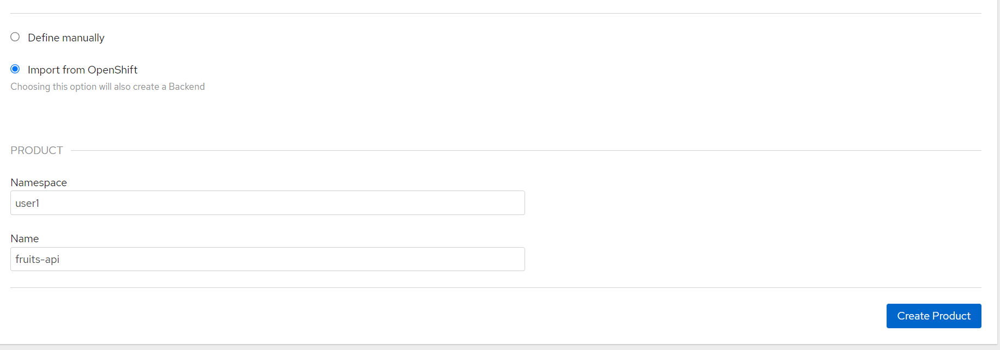

{empty} +

* in the next page you will see that a Product and a Backend were created.

{empty} +

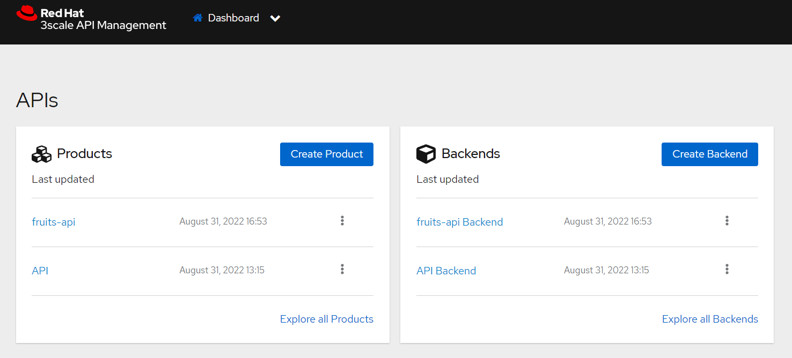

{empty} +

[type=verification]
Are you seeing the Product and Backend?

[time=5]
[id="testing-api"]
== Testing the API

Let's see how to test our newly created API Product.

* Go to the `Product` view and click on `fruits-api`.

{empty} +

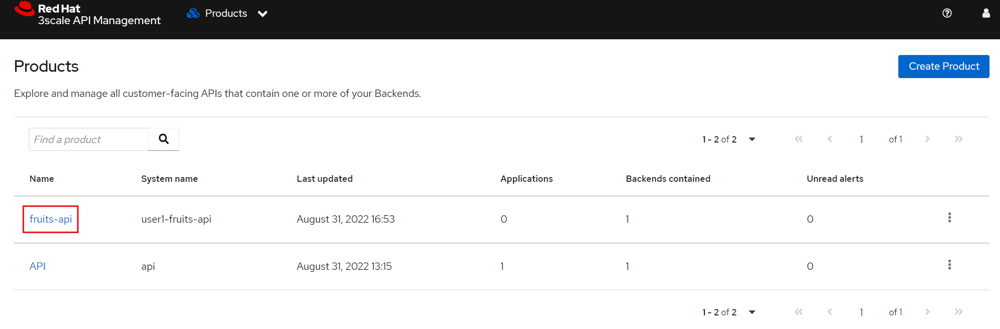

{empty} +

* The first thing we need to do to expose an API Product is to create an `Application Plan`
** On the left menu, click on `Applications` then click on `Applications Plans`
** On the top right, click on `Create Application plan`

{empty} +

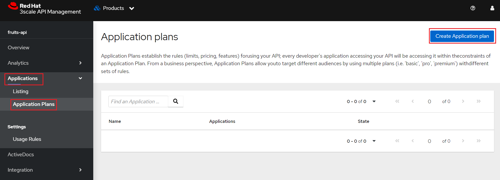

{empty} +

* Create a plan called `fruits-basic`

{empty} +

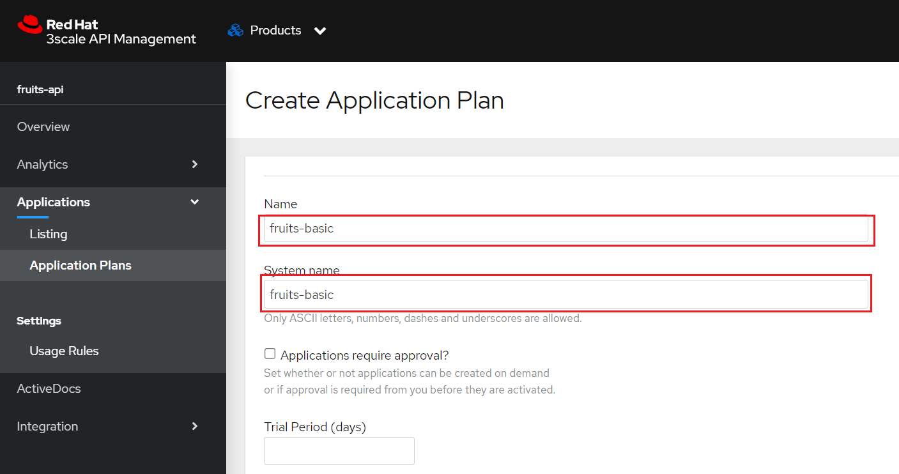

{empty} +

* After you save it, in the next page, publish the application plan

{empty} +

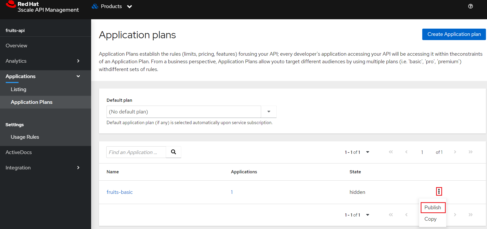

{empty} +

[type=verification]
did you publish the application plan?

The second thing we need to do is to create an application to consume this API.

* Still in the Product page, on your left, select `Applications` and then `Listing`
* Click on `Create Application`

{empty} +

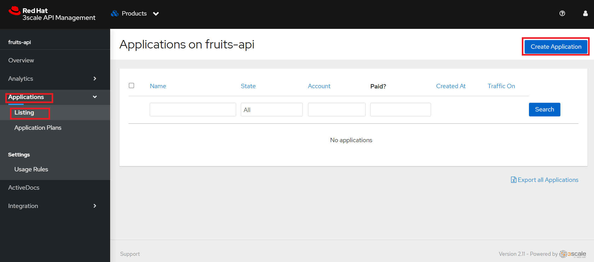

{empty} +

* Enter the following values in the form and then click on create:

{empty} +

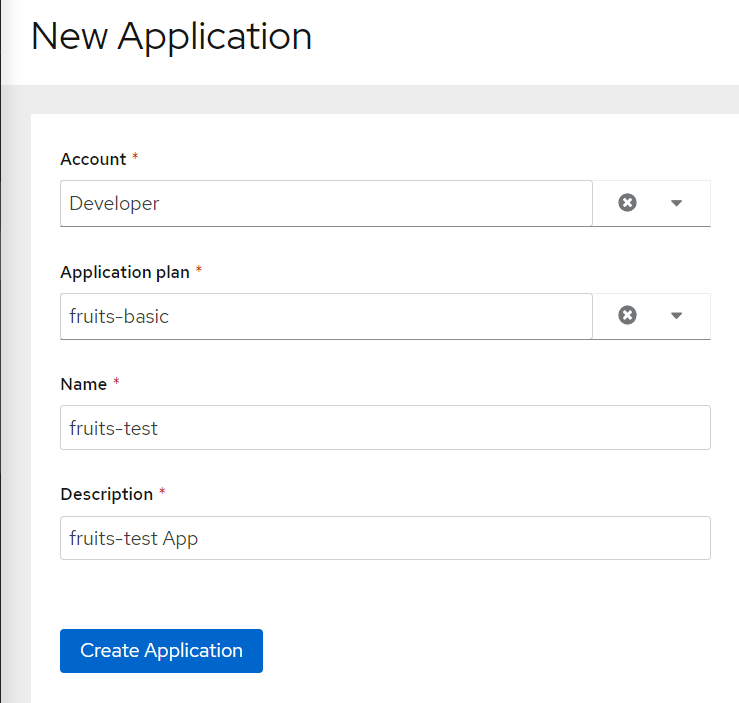

{empty} +

You will be redirected to the App page. There you will have information about the App, such as usage in the last 30 day and the API credentials.

{empty} +

The third and last thing we need to do before testing is to publish this API configuration.

* In the top dropdown select `Products` and then `fruits-api`
* In the fruits-api page, on your left, select `Integration` and then `Configuration`
* You will see that the API is already promoted to staging. That is enough for our test.

{empty} +

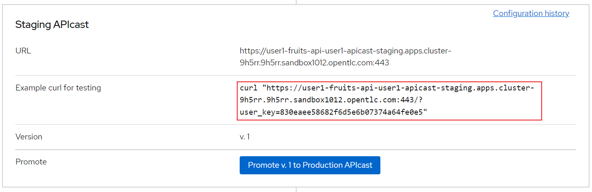

{empty} +

* Copy the API url from the curl command and paste it in a new browser tab. You should receive a json object like in the picture:

{empty} +

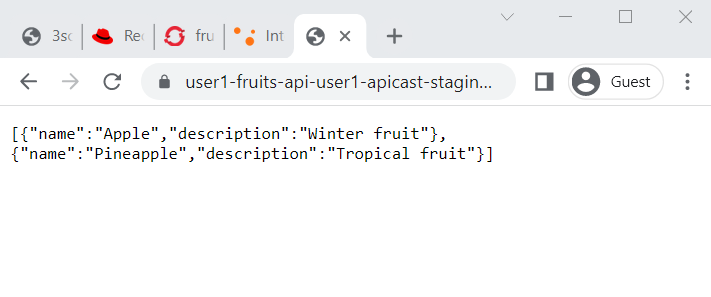

{empty} +

[type=verification]
did you receive the json response?

[time=1]
[id="summary"]
== Summary

For more detailed information about 3scale Service Discovery, look at link:https://access.redhat.com/documentation/en-us/red_hat_3scale_api_management/2.11/html-single/admin_portal_guide/index#service-discovery_service-discovery[product documentation].

We reached the end of our workshop. It was a pleasure to have you with us. This was just a taste of what 3scale can do. We hope that this content will get you started on our API Management tool.

See you soon!
